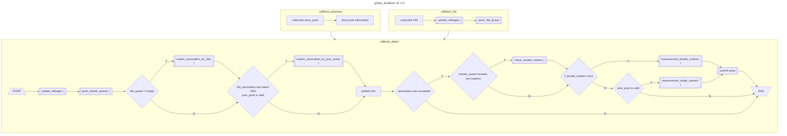

# Overview

The **GMPS Localizer** estimates vehicle pose by GMPS sensor output.
All magnetic markers must be listed in `marker.csv` file.
Data association is executed by comparing magnetic marker position
 predicted from vehicle position with marker table.


## Flowchart
The overall flowchart of gmps_localizer is decribed at the end of this document.

## Requirements
- [gmps_msgs](https://github.com/aichisteel-gmps/gmps_msgs)

## Features
This package includes the following features:

- **Yaw estimation from double markers**, which enables estimating x,y,yaw from two continuous markers with one GMPS sensor.

- **Initial pose estimation with RFID**, which enables data association without previous pose information.


## Launch

The `gmps_localizer` starts with the default parameters with following command.

```sh
ros2 launch gmps_localizer gmps_localizer.launch.xml
```

The parameters and input topic names can be set in the `gmps_localizer.launch.xml` file.


## Nodes
### Subscribed Topics
- in_prev_pose (geometry_msgs/PoseWithCovarianceStamped)  
  Previous pose infromation required for data association, 
  which is typically published from pose fusion filter such as EKF. 

- in_gmps_detect (gmps_msgs/GmpsDetect)  
  GMPS sensor ouput, which means lateral error from detected magnetic marker.

- in_rfid (gmps_msgs/Rfid)  
  RFID tag number written in EPC frame.

- in_velocity (geometry_msgs/TwistWithCovarianceStamped)  
  Vehicle speed.

### Published Topics
- gmps_pose (geometry_msgs/PoseWithCovarianceStamped)  
  Estimated pose with covariance matrix.

- gmps_log (gmps_msgs/GmpsLog)  
  GMPS sensor output and result of data association, for logger.


### Pulished TF
- gmps_link  
  TF from "map" coordinate to estimated pose.


## Functions
#### load marker csv  
Magnetic marker table csv file consists of following columns.

| Column    |Description   | 
| :-------- | :----- | 
|mm_id |User defined number of magnetic markers.|
|tag_id | RFID tag number written in EPC frame.|
|mm_kind | Type of magnetic markers. [not used] |
|pole | Magnetic pole of magnetic markers. |
|x | position of magnetic markers in "map" coordinate.|
|y | position of magnetic markers in "map" coordinate.|

#### data association
- marker_association_by_rfid
- marker_association_by_prev_pose

#### measurement pose
- measurement_double_marker
- measurement_single_marker


## Parameter description

The parameters are set in `launch/gmps_localizer.launch.xml` .


### For pose measurement

| Name      | Type   | Description    | 
| :--------- | :----- | :----------- | 
| enable_pole | bool | Enable/Disable magnetic pole filtering at data association. |
| enable_rfid | bool | Enable/Disable RFID tag_id filtering at data association.  |
| marker_table_csv_name| string | File path of magnetic marker table |
| tf_x | double | tf from baselink to GMPS sensor [m]                       | 
| tf_y | double | tf from baselink to GMPS sensor [m] | 
| tf_yaw| double | tf from baselink to GMPS sensor [rad] | 
|tf_rfid_x | double | tf from baselink to RFID R/W [m]|
| sigma_x_gmps        | double | std_dev of X of gmps_pose [m] |
| sigma_y_gmps        | double | std_dev of Y of gmps_pose [m] |
| sigma_theta_gmps      | double | std_dev of Yaw of gmps_pose [rad] | 

## Algorithm
/* transform from vehicle to marker */

$$\hat{x}_{m} = x_c + e_m\sin(\theta_c) - l_m^\prime \cos(\theta_c)$$  

$$\hat{y}_{m} = y_c - e_m\cos(\theta_c) - l_m^\prime \sin(\theta_c)$$  

/* magnetic marker association */

$$ i = \arg \min _j \sqrt{ (x_m^{(j)} - \hat{x}_m )^2 + (y_m^{(j)}-\hat{y}_m)^2} $$

/* transform from marker to vehicle, including delay */

$$ \tilde{x}_c = x_m^{(i)} - e_m\sin(\theta_c) + l_m^\prime \cos(\theta_c) $$

$$\tilde{y}_c = y_m^{(i)} + e_m\cos(\theta_c) + l_m^\prime \sin(\theta_c)$$


# flowchart by mermaid

